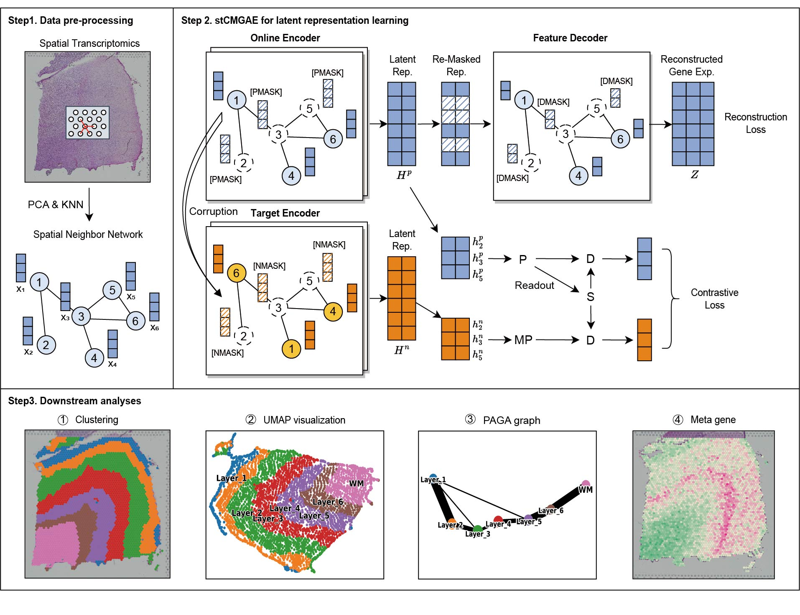

# Contrastive Masked Graph Autoencoders for  Spatial Transcriptomics Data Analysis
## Introduction
In our research, we introduce a novel graph self-supervised learning model termed Contrastive Masked Graph Autoencoder (stCMGAE). This model aims to enhance the clustering performance of spatial transcriptomics data by leveraging contrastive learning and a masked mechanism. Masking mechanisms minimize redundancy in graph structures, enhancing the model's ability to learn expressive features, while contrastive learning methods facilitate the aggregation of similar points and separation of points from different clusters, promoting the acquisition of discriminative feature representations.Experimental results demonstrate that our method outperforms ohter baseline models across three ST datasets, effectively improving spatial domain recognition capabilities. 

## Installations
- Windows
- NVIDIA GPU (a single Nvidia GeForce RTX 3090)
-   `pip install -r requiremnts.txt`

## Get Started
- See  `Tutorial.ipynb`
